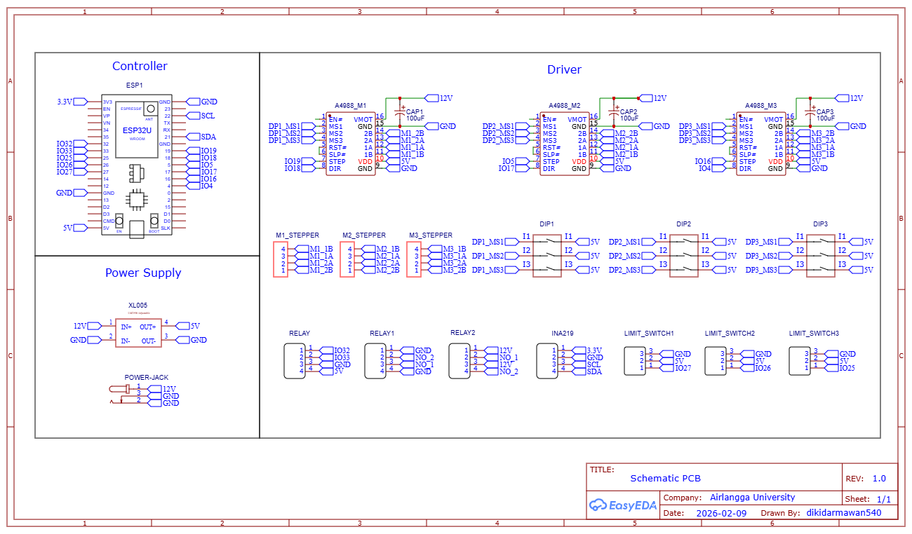

# 🤖 Waste Sorting Robot 3-DOF 

An intelligent automatic waste sorting robot that integrates YOLOv11-Seg for real-time object detection and segmentation, an ESP32-based motion controller, an Omron PLC for conveyor automation, and a custom 3-DOF robotic arm with a vacuum gripper for autonomous waste classification and pick-and-place operations.

---

## The Entire System 📸

---

## Features
- YOLOv11 Instance Segmentation
- 3-DOF Robot Arm
- PLC Conveyor Control
- ESP32 Motion Control

---

## Hardware

- ESP32 DevKit V4
- Omron CP1L PLC
- NEMA17 Stepper Motor
- A4988 Driver
- Webcam
- Vacuum Pump

---

## Schematic

---

## Software

- Python
- OpenCV
- Ultralytics YOLOv11
- Arduino IDE

---

## Performance

| Metric | Value |
|--------|--------|
| mAP50 | 98% | Waste|
| Success Rate | 93.6% |
| Average Cycle Time | 12.55 s |

---

## 📹 Demo

Coming Soon
